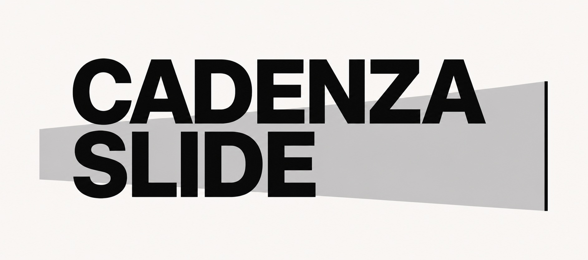
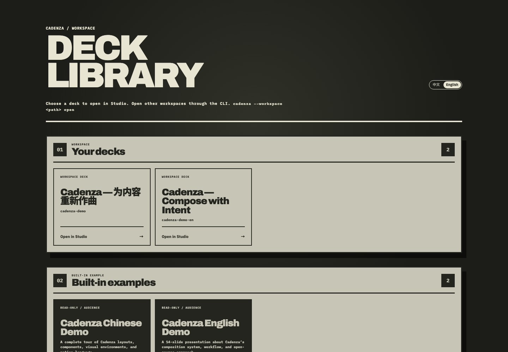
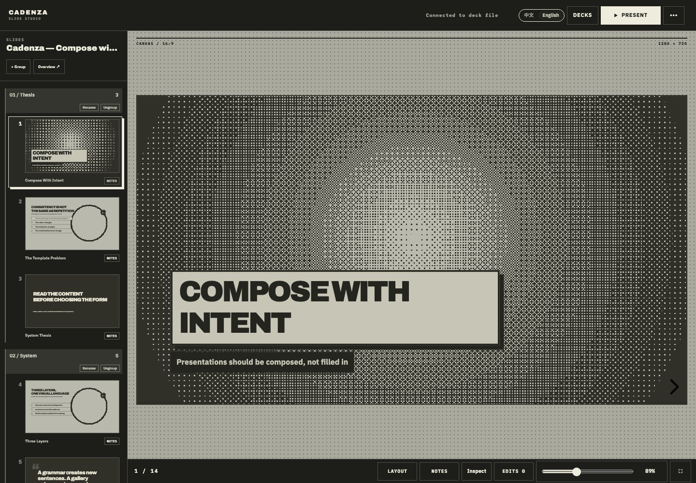
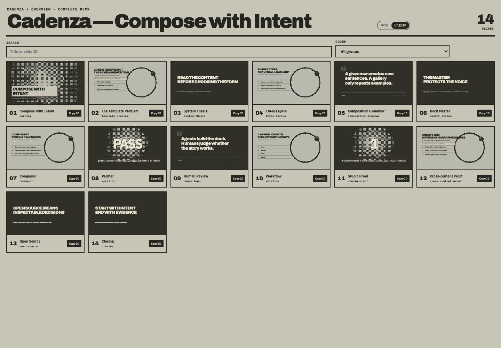
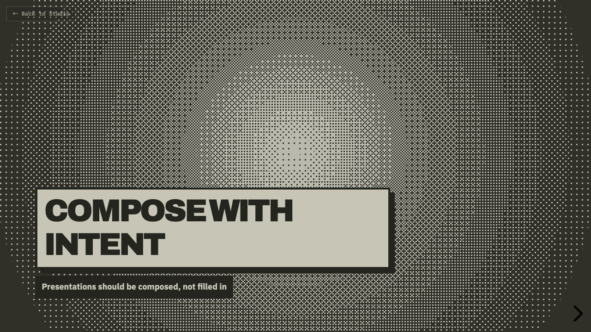

<p align="center">
  
</p>

# CadenzaSlide

[English](README.md) · [简体中文](README.zh-CN.md)

CadenzaSlide is a local-first presentation runtime and authoring system built
for AI agents. The agent owns reasoning and edits a portable
`deck.cadenza.json`; Cadenza owns deterministic rendering, preview, playback,
and verification. Cadenza itself does not call an AI model or require an API
key.

> Status: early-stage software. The document format and CLI may still change.

## Why CadenzaSlide

Most presentation tools either give people a blank canvas or ask AI to emit a
one-off result. CadenzaSlide separates creative reasoning from presentation
infrastructure: the host Agent understands the material and authors a portable
deck, while Cadenza supplies the design system, deterministic renderer,
verification, and presentation runtime.

The goal is not one polished demo. It is a reusable production system in which
the Skill, Composer, component library, and Verifier turn repeated lessons into
better defaults for the next deck—across different subjects, structures, and
levels of information density.

## The Cadenza aesthetic

- **Editorial, not dashboard-like.** Strong typography, deliberate scale, and
  clear visual hierarchy replace grids of interchangeable cards.
- **A coherent monochrome image language.** One Bit and tonal treatments bring
  photos, screenshots, diagrams, and illustrations from different sources into
  the same visual world while preserving evidence that must remain legible.
- **One claim, supported by evidence.** Real media, data, quotations, and
  observable results take priority over decorative UI chrome.
- **Designed for a stage.** Every slide is composed for a fixed audience
  viewport; Overview controls rhythm, while full-size Audience review decides
  whether the result is actually finished.
- **Motion with restraint.** Low-amplitude environmental movement creates a
  living canvas; transitions clarify narrative change instead of decorating
  every element.
- **Consistency without sameness.** Layouts and components enforce recognizable
  Cadenza character while allowing compositions to vary with the content.

## What it provides

- A portable, JSON-based deck and workspace format.
- Studio, Overview, Audience, and Speaker views.
- Chinese and English application chrome with browser-language detection and an
  explicit language switcher.
- A fixed-stage renderer with layouts, components, media, notes, and motion.
- Static and browser verification before presentation.
- A `cadenza-presentations` Skill that teaches compatible agents the complete
  authoring and review workflow.

## Product tour

Choose a workspace deck or open the built-in example from the local Deck
Library. The interface can follow the browser language or be pinned with
`?lang=en` and `?lang=zh-CN`.



Studio keeps the complete authoring loop in one workspace: reorder slides,
manage groups, inspect the fixed 16:9 canvas, edit speaker notes, review layout
slots, queue precise Agent edits, and launch a presentation.



Overview shows the whole narrative in playback order for rhythm, repetition,
and group review. Audience uses the same deterministic 1280×720 rendering for
the actual presentation instead of a separate export path.

| Overview | Audience |
| --- | --- |
|  |  |

The deck content and application language are independent. A Chinese or
English deck can therefore run inside either interface without duplicating the
renderer or presentation runtime.

## Requirements

- Node.js 22.18 or newer
- npm
- Chromium installed by Playwright for browser verification

## Install from source

After cloning this repository:

```bash
npm ci
npm run build
npm link
```

`npm link` makes the `cadenza` command available locally. Repository
contributors can use `npm run cadenza --` instead.

To use the agent workflow, install the public Skill separately:

```bash
npx skills@latest add SuperTapir/tapir-skills --skill cadenza-presentations
```

## Quick start

```bash
cadenza init my-talk
cd my-talk
cadenza new product-launch --title="Product Launch"
cadenza open
```

Then ask a compatible agent to use `$cadenza-presentations` and author the
deck in `decks/product-launch/deck.cadenza.json`. Keep local media inside
`decks/product-launch/assets/` and reference it as `assets/<file>`.

Before presenting:

```bash
cadenza verify product-launch --browser
cadenza overview product-launch
cadenza present product-launch
```

## CLI

| Command | Purpose |
| --- | --- |
| `cadenza init [path]` | Create a Cadenza workspace. |
| `cadenza new <deck-id>` | Create an outline deck with a default master. |
| `cadenza list` | List decks in the current workspace. |
| `cadenza open [path]` | Open the local deck library and Studio. |
| `cadenza inspect <deck-id>/slide:<slide-id>` | Inspect one authored slide. |
| `cadenza visuals "<intent>"` | Query the curated visual asset catalog. |
| `cadenza verify <deck-id> [--browser]` | Validate the file and rendered result. |
| `cadenza overview <deck-id>` | Review the complete deck in order. |
| `cadenza present <deck-id>` | Verify and launch the presentation. |
| `cadenza diff <deck-id>` | Summarize deck changes. |

Run `cadenza --help` for the current command contract.

## Workspace format

```text
my-talk/
├── cadenza.config.json
└── decks/
    └── product-launch/
        ├── deck.cadenza.json
        └── assets/
```

The deck JSON is the source of truth. The runtime and workspace are separate,
so a deck can move between machines without copying Cadenza source or build
artifacts.

## Development

```bash
npm run dev       # Vite development server
npm test          # Unit and integration tests
npm run test:e2e  # Playwright end-to-end tests
npm run build     # Browser and CLI production builds
```

Architecture details live in [`docs/architecture.md`](docs/architecture.md).

## Privacy and security

The workspace server binds to `127.0.0.1` by default. Cadenza does not send
deck content to a model provider; the host agent and its permissions determine
how source material is accessed. Do not place private decks in this repository.

## License

CadenzaSlide is available under the [MIT License](LICENSE). Bundled icons and
fonts retain their own licenses; see
[THIRD_PARTY_NOTICES.md](THIRD_PARTY_NOTICES.md).
