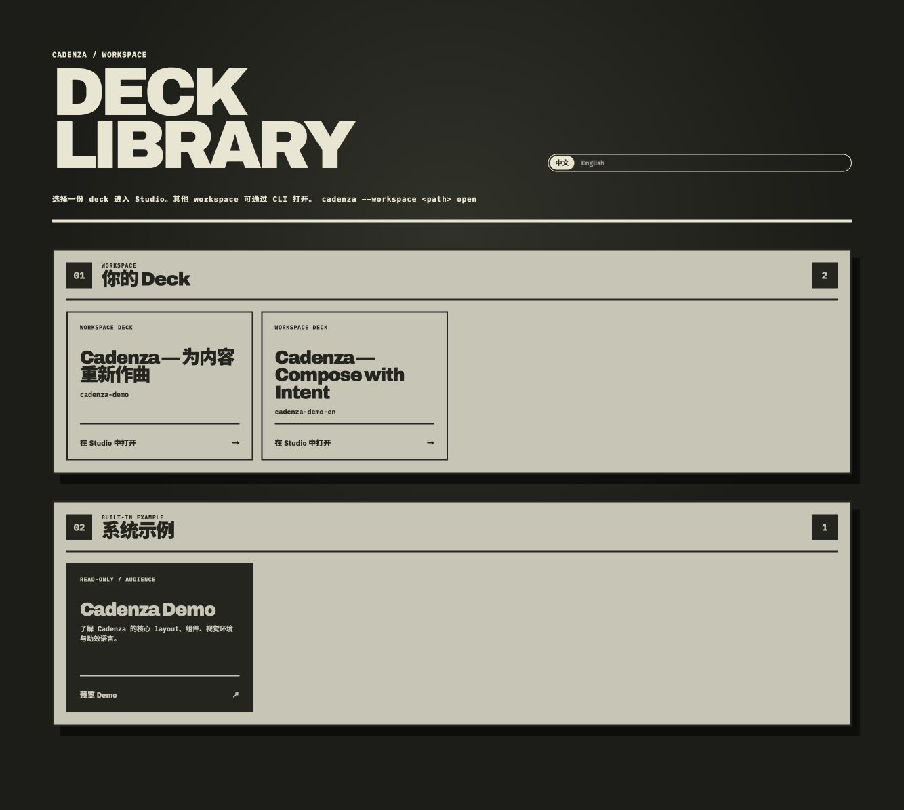
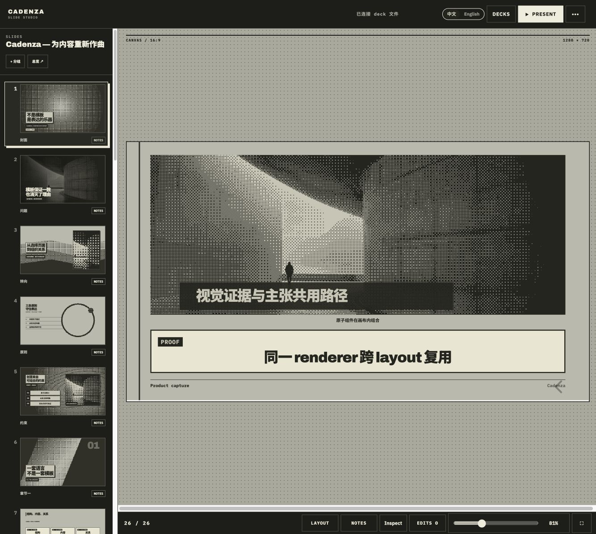
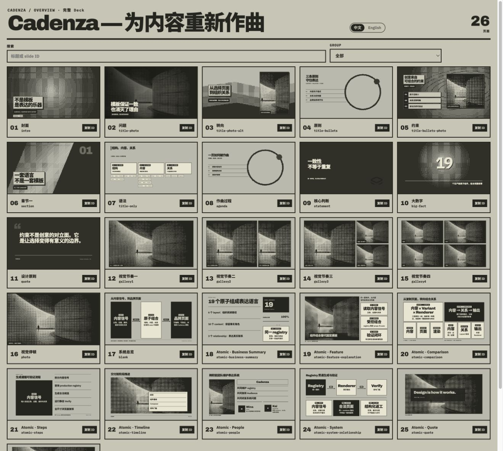
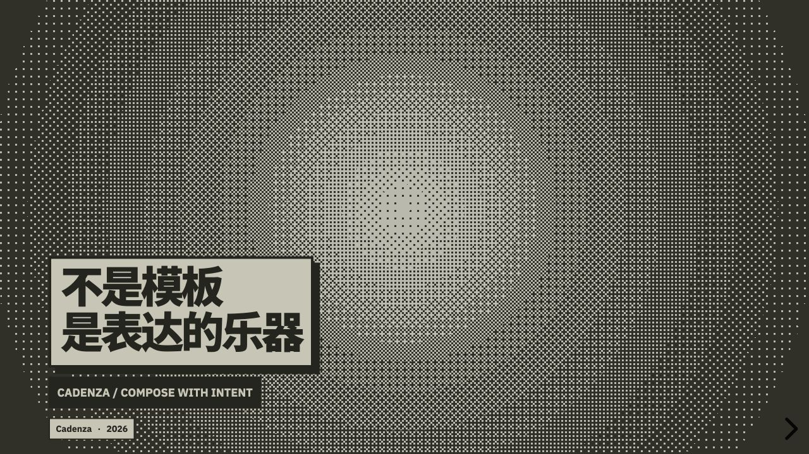

<p align="center">
  
</p>

# CadenzaSlide

[English](README.md) · [简体中文](README.zh-CN.md)

CadenzaSlide 是一套面向 AI Agent 的本地优先演示运行时与创作系统。Agent
负责理解内容、做出判断并修改可迁移的 `deck.cadenza.json`；Cadenza 负责确定性
渲染、预览、播放和验证。Cadenza 本身不会调用 AI 模型，也不需要 API key。

> 当前状态：早期版本，文档格式与 CLI 仍可能调整。

## 为什么选择 CadenzaSlide

大多数演示工具要么给人一张空白画布，要么让 AI 生成一份一次性结果。
CadenzaSlide 将创作判断与演示基础设施分开：Host Agent 负责理解素材并创作可迁移的
deck，Cadenza 负责设计系统、确定性渲染、验证和放映运行时。

目标不是打磨好一份 Demo，而是建立一套可复用的生产系统。Skill、Composer、组件库和
Verifier 会把反复出现的经验转化为下一份演示的更好默认能力，使同一套方法能够跨主题、
内容结构和信息密度稳定工作。

## Cadenza 美学

- **编辑设计，而非仪表盘。** 使用强排版、明确的尺度关系和清晰的视觉层级，避免由同质卡片
  拼成页面。
- **统一的单色图像语言。** One Bit 与 tonal 处理让不同来源的照片、截图、图表和插画进入
  同一个视觉世界，同时保留必须清晰可读的证据。
- **一页一个主张，由证据支撑。** 真实媒体、数据、引言和可观察结果优先于装饰性 UI chrome。
- **为舞台而设计。** 每一页都面向固定 Audience viewport 构图；Overview 用于控制整场节奏，
  Audience 全尺寸审查决定页面是否真正完成。
- **克制的运动。** 低幅环境动效让画布保持生命感；转场用于说明叙事变化，而不是装饰每个元素。
- **一致但不雷同。** Layout 与组件维持可辨认的 Cadenza 调性，同时允许构图随内容变化。

## 提供的能力

- 可迁移的 JSON deck 与 workspace 格式。
- Studio、Overview、Audience 与 Speaker 视图。
- 支持浏览器语言识别与显式切换的中英文界面。
- 支持布局、组件、媒体、讲者备注和动画的固定画布 renderer。
- 演示前的静态验证与真实浏览器验证。
- `cadenza-presentations` Skill，为兼容的 Agent 提供完整创作和审阅流程。

## 产品界面

在本地 Deck Library 中选择 workspace deck，或直接打开内置示例。界面会跟随浏览器
语言，也可以使用 `?lang=en` 与 `?lang=zh-CN` 固定语言。



Studio 将完整创作闭环集中在同一个工作区：页面排序与分组、固定 16:9 画布、Speaker
Notes、Layout 位置检查、面向 Agent 的精确修改队列以及放映入口。



Overview 按放映顺序展示完整叙事，用于检查节奏、重复和章节关系。Audience 使用同一份
确定性 1280×720 渲染进行正式放映，不存在另一条容易产生偏差的导出路径。

| Overview | Audience |
| --- | --- |
|  |  |

Deck 内容语言与应用界面语言彼此独立，因此中文或英文 deck 都可以运行在任一界面语言下，
无需复制 renderer 或 presentation runtime。

## 环境要求

- Node.js 22.18 或更高版本
- npm
- 使用 browser verification 时，需要安装 Playwright 的 Chromium

## 从源码安装

克隆仓库后运行：

```bash
npm ci
npm run build
npm link
```

`npm link` 会在本机提供 `cadenza` 命令。仓库贡献者也可以使用
`npm run cadenza --`。

如需使用 Agent 创作流程，另外安装公开 Skill：

```bash
npx skills@latest add SuperTapir/tapir-skills --skill cadenza-presentations
```

## 快速开始

```bash
cadenza init my-talk
cd my-talk
cadenza new product-launch --title="产品发布"
cadenza open
```

然后让兼容的 Agent 使用 `$cadenza-presentations`，编辑
`decks/product-launch/deck.cadenza.json`。本地媒体统一放进
`decks/product-launch/assets/`，并在 JSON 中写成 `assets/<file>`。

演示前运行：

```bash
cadenza verify product-launch --browser
cadenza overview product-launch
cadenza present product-launch
```

## CLI

| 命令 | 用途 |
| --- | --- |
| `cadenza init [path]` | 创建 Cadenza workspace。 |
| `cadenza new <deck-id>` | 创建带默认母版的 outline deck。 |
| `cadenza list` | 列出当前 workspace 中的 deck。 |
| `cadenza open [path]` | 打开本地 Deck Library 与 Studio。 |
| `cadenza inspect <deck-id>/slide:<slide-id>` | 检查一个已创作页面。 |
| `cadenza visuals "<intent>"` | 查询经过筛选的视觉资产目录。 |
| `cadenza verify <deck-id> [--browser]` | 验证文件与真实渲染结果。 |
| `cadenza overview <deck-id>` | 按顺序复查完整演示。 |
| `cadenza present <deck-id>` | 验证并启动演示。 |
| `cadenza diff <deck-id>` | 汇总 deck 变更。 |

使用 `cadenza --help` 查看当前命令契约。

## Workspace 格式

```text
my-talk/
├── cadenza.config.json
└── decks/
    └── product-launch/
        ├── deck.cadenza.json
        └── assets/
```

Deck JSON 是唯一内容来源。Runtime 与 workspace 相互独立，因此迁移 deck
时不需要复制 Cadenza 源码或构建产物。

## 开发

```bash
npm run dev       # Vite 开发服务器
npm test          # 单元测试与集成测试
npm run test:e2e  # Playwright E2E 测试
npm run build     # 构建浏览器应用与 CLI
```

架构说明见 [`docs/architecture.md`](docs/architecture.md)。

## 隐私与安全

Workspace server 默认只监听 `127.0.0.1`。Cadenza 不会把 deck 内容发送给
模型提供方；Host Agent 及其权限决定如何访问源材料。请勿把私人 deck 放进本仓库。

## 许可证

CadenzaSlide 使用 [MIT License](LICENSE)。内置图标和字体保留各自许可证，详见
[THIRD_PARTY_NOTICES.md](THIRD_PARTY_NOTICES.md)。
